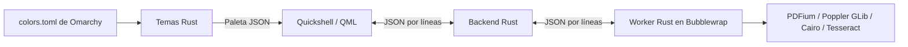

# Arquitectura

[Índice de documentación](README.md)

- `qml/Main.qml`, `FilePicker.qml`, `PdfPage.qml`: ventana, controles, presentación de imágenes, resaltados, selección con ratón y portapapeles. Todo el frontend permanece en Quickshell.
- `rust/pdf/src/main.rs`: servicio `pdf-view-backend`. Abre documentos locales, conserva el descriptor, usa Rustix para los descriptores del proceso, controla tres canales de trabajo, cancela solicitudes, aplica timeouts, valida respuestas y mantiene la caché.
- `rust/pdf/src/worker.rs` y `native.rs`: ejecutable `pdf-worker`, operaciones PDF/OCR y única frontera FFI. Nunca se carga PDFium, Poppler o Tesseract en el servicio que tiene acceso al entorno del usuario.
- `rust/pdf/src/lib.rs`: protocolo, límites y tipos compartidos.
- `rust/theme`: servicio de temas Rust con `toml`, `notify` y salida JSON.

Quickshell usa `Quickshell.Io.Process` y JSON por líneas sobre stdin/stdout. Cada solicitud lleva un identificador; la interfaz descarta respuestas anteriores al cambiar de documento, página o consulta. No hay servidor HTTP, sockets abiertos ni contraseñas en argumentos de proceso. El worker también usa JSON por líneas: devuelve metadatos y píxeles RGB sin compresión, codificados en base64. Rust valida la respuesta y codifica el PNG que consume QML; el parser PDF nunca entrega directamente un archivo de imagen a Qt.

## Flujo de un documento

1. Quickshell envía la URL local al backend.
2. Rust abre y valida el archivo, conserva su descriptor y lanza el worker dentro de Bubblewrap.
3. El worker usa Poppler, Cairo y, cuando corresponde, Tesseract para ejecutar una operación.
4. El backend valida los metadatos y píxeles recibidos, genera el PNG y publica la respuesta.
5. QML aplica la respuesta si su identificador sigue vigente y presenta la página, el texto o los resultados.

## Contratos IPC

| Canal | Petición / respuesta |
|---|---|
| QML → backend | `id`, `kind`, `op` y parámetros de la operación |
| Backend → QML | `id`, `kind`, `data` |
| Backend → worker | Operaciones secuenciales por worker persistente; parámetros por stdin y PDF montado por descriptor |
| Worker → backend | `meta` y `pixels`; RGB codificado en base64 |
| Temas → QML | `palette` y `status`, sin solicitud previa |

`kind` distingue renderizado (`0`), búsqueda (`1`) y operaciones auxiliares (`2`). Las operaciones del visor incluyen `open`, `unlock`, `render`, `search`, `thumbnail`, `region`, `text`, `extract` y `cancel`. El backend gestiona apertura, contraseña y cancelación; el worker ejecuta las operaciones PDF.

Los índices de página empiezan en 1. La rotación del worker se expresa en cuartos de vuelta, de 0 a 3; la interfaz presenta grados. Las palabras usan rectángulos en puntos PDF con origen superior izquierdo; QML transforma las coordenadas según la rotación. Las regiones de detalle usan coordenadas normalizadas sobre la página rotada.

Stdout está reservado al protocolo y stderr a diagnósticos. El backend retira los identificadores de la petición al crear la operación interna del worker: no hay que confundir ese contrato con las respuestas correlacionadas del frontend.

## Concurrencia y caché

Existen tres canales de trabajo. Una solicitud nueva cancela la anterior del mismo canal; al abrir otro documento se cancelan todos. QML también descarta respuestas obsoletas. Las miniaturas y regiones comparten el canal auxiliar con la extracción de rangos.

La caché vive en el backend y contiene respuestas de imagen validadas. Se invalida al abrir otro documento, cambiar de contraseña o detectar cambios en tamaño/fecha del archivo. Los parámetros de OCR forman parte de las solicitudes y distinguen sus resultados. Cada canal reutiliza un worker y su documento abierto. La apertura de otro archivo, cambios del archivo o de contraseña descartan los workers. La cancelación activa o un error de protocolo también descartan el worker afectado.

La interfaz utiliza `Image` y `Canvas` de Qt Quick, sin un módulo Qt/C++ propio. Consulta los presupuestos concretos en [Seguridad y límites](seguridad.md).

## Primera imagen y texto diferido

QML abre con 54 dpi, `text:false` y `outline:false`. La imagen se publica sin esperar extracción, índice ni OCR. Después solicita el renderizado de mayor resolución en el canal 0 y `text` en el canal 2; la selección se habilita al llegar las palabras. Un fallo de OCR no retira la imagen visible. La primera apertura sigue teniendo un tiempo de procesamiento real; no se muestra un modal de carga.

PDFium se usa para imagen base, miniaturas y regiones. Poppler mantiene geometría, permisos, búsqueda, índice y texto; Tesseract conserva OCR. El binding y la biblioteca PDFium solo se cargan en el worker, montada en `/app/libpdfium.so`. No se copian bibliotecas al directorio personal ni se ejecutan acciones del PDF.

El visor precarga imágenes a resolución de lectura de dos páginas por delante y por detrás en el canal de renderizado libre. Texto y OCR no bloquean esa precarga. Reutiliza las imágenes al cambiar de página y mantiene su imagen al refinar el zoom. Conserva los delegados de páginas que siguen visibles, agregando o retirando únicamente los extremos del modelo. El flujo continuo actual aproxima la altura de todas las páginas con la de la página activa; documentos de tamaños mixtos todavía pueden mover el desplazamiento al cambiar de página.

## Guardado de anotaciones

`save` en el canal 2 contiene página, tipo `note`/`underline`, rectángulos y texto. El worker abre una instancia independiente del PDF, verifica permisos y ausencia de cifrado/firma, añade la anotación y exporta a memoria con límite de 256 MiB. Reabre esa salida en PDFium antes de devolverla. El broker recibe `bytes` y solicita `export_chunk` con offsets consecutivos; los fragmentos JSON/base64 contienen hasta 1 MiB. Nunca envía el PDF completo al frontend.

`save.rs` comprueba identidad y marcas de modificación del archivo abierto, crea un archivo de preparación exclusivo en la misma carpeta, valida tamaños/cabecera/final de exportación, sincroniza y sustituye el destino mediante rename. Ante errores previos al reemplazo, elimina la preparación y conserva el original. La preparación es parte del guardado atómico, no un canal IPC. Tras guardar, QML vacía las imágenes y reabre el archivo en la misma página. Las respuestas `text` incluyen `annotations` y `canAnnotate` validados por el broker.

### Acciones de selección

`PdfPage.qml` mantiene selección y estado de anotación y emite `selectionFinished` al soltar el botón izquierdo. `Main.qml` transforma el punto a coordenadas de la ventana y coordina las acciones. `components/SelectionToolbar.qml` presenta un popup sin acceso a IPC; emite señales para subrayar, añadir nota o copiar. `components/AnnotationColors.qml` centraliza la paleta, compartida con `NotesDialog.qml`. El color de la anotación se conserva en `PdfPage.annotationColor` y se envía como `#RRGGBB` al mismo flujo de guardado existente.

Rust valida los seis dígitos hexadecimales y escribe el color RGB en la anotación PDF. La lectura de anotaciones devuelve el color, validado de nuevo antes de entregarlo a QML. Los colores de tinta son independientes de la paleta Omarchy; el resto de los controles continúa usando el tema.

Poppler lee los metadatos y colores de anotaciones desde la página ya abierta. Se evita `stroke_color()` de pdfium-render 0.9.4: su fallback para apariencias convierte un handle de anotación en uno de objeto de página, lo que provoca un cierre nativo tras renderizar. PDFium conserva el renderizado y la escritura de anotaciones.

Los QuadPoints de subrayado se escriben en orden Z: superior izquierdo, superior derecho, inferior izquierdo, inferior derecho. No se usa la conversión genérica de rectángulo a polígono, cuyo orden antihorario producía marcas casi invisibles en PDFium.
